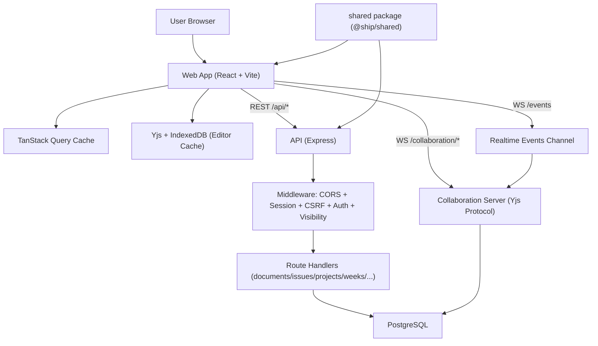
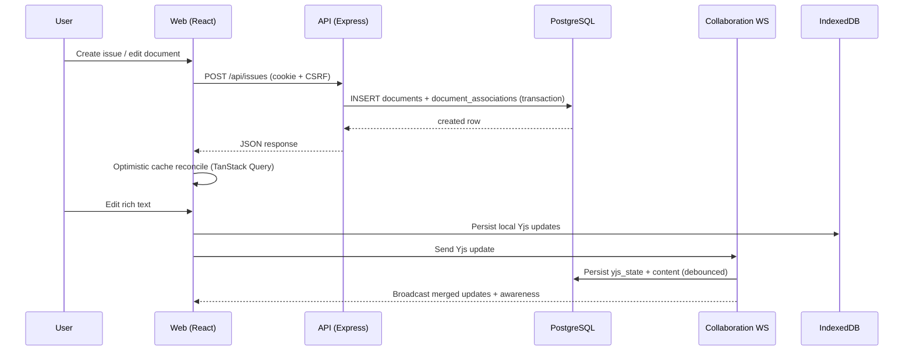
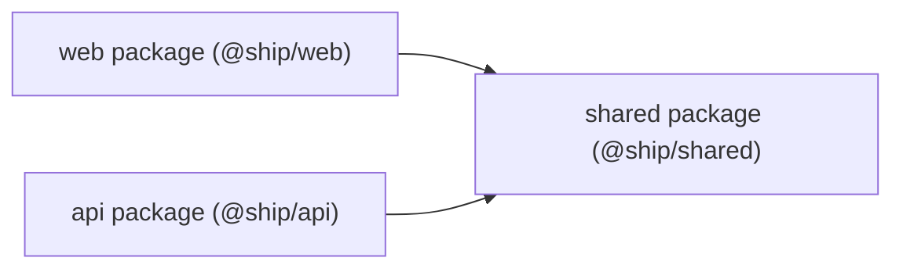
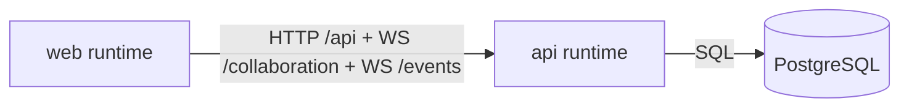
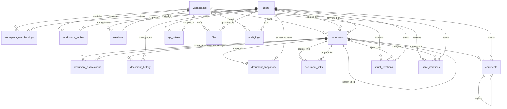

# [ORIENTATION.md](http://ORIENTATION.md)

## Appendix: Codebase Orientation Checklist

Date: 2026-03-09
Repository: `/Users/ivanma/Desktop/gauntlet/ShipShape/ship`

This is a first-pass orientation document to build a system-wide mental model before auditing.

---

## Phase 1: First Contact

### 1. Repository Overview

- Status: `partial execution + full static review`

#### Clone + run steps (observed + inferred from scripts)

1. `git clone https://github.com/US-Department-of-the-Treasury/ship.git`
2. `cd ship`
3. `pnpm install`
4. Ensure local PostgreSQL is running.
5. `pnpm dev`

What actually happens (from `scripts/dev.sh`):

- Auto-creates `api/.env.local` if missing.
- Derives DB name from worktree folder name (e.g. `ship_<worktree>`).
- Creates database if needed.
- On fresh DB: runs migrations + seed.
- Finds available API/Web ports automatically.
- Writes `.ports` file and starts API + web in parallel.

Runtime validation status:

- API unit tests have been executed successfully (`451/451` passing; see Testing Infrastructure section).
- Full local boot verification (`pnpm dev` output/port capture) and E2E execution remain follow-up items.

#### Read every file in `docs/`

I reviewed all Markdown docs under `docs/` (including `docs/claude-reference/*` and `docs/research/*`) and skipped only image binaries under `docs/screenshots/`.

Key architectural decisions (in my words):

- Unified model: almost all product entities are rows in `documents`, differentiated by `document_type` and `properties` JSONB.
- Associations are explicit via `document_associations` (`program`, `project`, `sprint`, `parent`) rather than multiple legacy foreign-key columns.
- Collaboration is Yjs CRDT over WebSocket with PostgreSQL persistence of `yjs_state` and JSON `content` fallback.
- Auth model is session-cookie first (15-minute idle, 12-hour absolute), with API token support for programmatic access.
- Frontend state is TanStack Query (metadata/lists) plus Yjs/IndexedDB (editor content).
- Philosophy: “everything is a document”, 4-panel editor UI, and required week documentation with non-blocking accountability indicators.

Architecture and system design diagram:




Data flow diagram:




Primary architecture docs used:

- `docs/unified-document-model.md`
- `docs/application-architecture.md`
- `docs/document-model-conventions.md`
- `docs/week-documentation-philosophy.md`

#### `shared/` package review

`@ship/shared` is the cross-package contract layer for Ship. It is not just DTOs; it also contains a few shared domain helpers used at runtime.

How the package is wired:

- `shared` builds to `shared/dist` (`shared/package.json`, `main`/`types` point to `dist/index`).
- `api` and `web` both depend on `"@ship/shared": "workspace:*"`.
- `api/tsconfig.json` resolves `@ship/shared` to `../shared/dist/*` to consume built artifacts.
- `web/tsconfig.json` references `../shared` so editor/type-checking sees the same contracts.

Shared contract map:


| Module                                      | Core Exports                                                                                                                    | API Usage                                                                                         | Web Usage                                                                                                                | Why It Matters                                                                                                 |
| ------------------------------------------- | ------------------------------------------------------------------------------------------------------------------------------- | ------------------------------------------------------------------------------------------------- | ------------------------------------------------------------------------------------------------------------------------ | -------------------------------------------------------------------------------------------------------------- |
| `shared/src/types/document.ts`              | `DocumentType`, `IssueState`, `IssuePriority`, `BelongsTo`, `ApprovalTracking`, `DEFAULT_PROJECT_PROPERTIES`, `computeICEScore` | `api/src/routes/projects.ts`, `api/src/routes/dashboard.ts`, `api/src/services/accountability.ts` | `web/src/hooks/useIssuesQuery.ts`, `web/src/components/sidebars/ProjectSidebar.tsx`, `web/src/lib/contextMenuActions.ts` | Single source of truth for document semantics, association shapes, and scoring logic used by both FE and BE    |
| `shared/src/constants.ts`                   | `HTTP_STATUS`, `ERROR_CODES`, `SESSION_TIMEOUT_MS`, `ABSOLUTE_SESSION_TIMEOUT_MS`                                               | `api/src/middleware/auth.ts`, `api/src/routes/auth.ts`, `api/src/routes/workspaces.ts`            | `web/src/hooks/useSessionTimeout.ts`                                                                                     | Prevents auth/status-code drift between middleware and client timeout behavior                                 |
| `shared/src/types/api.ts`                   | `ApiResponse<T>`, `ApiError`                                                                                                    | Used as canonical response envelope model in typed contexts                                       | Referenced by generic request wrappers and consumers                                                                     | Defines consistent success/error envelope contract (even though some legacy routes still return custom shapes) |
| `shared/src/types/workspace.ts` + `user.ts` | `Workspace`, `WorkspaceMembership`, `WorkspaceInvite`, `AuditLog`, `User`                                                       | Shared modeling for workspace/admin surfaces                                                      | Used by workspace/admin UI flows and API clients                                                                         | Keeps admin and workspace lifecycle fields aligned across packages                                             |
| `shared/src/types/auth.ts`                  | (intentionally minimal/empty currently)                                                                                         | No active runtime contract here                                                                   | No active runtime contract here                                                                                          | Signals that auth request/response typing is currently local to API/Web packages                               |


Practical contract examples that improve mental model:

- Session rules are shared constants, so the same timeout values drive server enforcement and client UX timers.
- Association shape is shared (`BelongsTo`/`BelongsToType`), so issue filters and update payloads use the exact same relation model as the backend.
- ICE scoring is shared (`computeICEScore`), so project scores shown in UI and computed in API endpoints cannot diverge unless shared code changes.

#### Package relationship diagram (`web/`, `api/`, `shared/`)

Strict package dependency graph:




Runtime communication graph (not package imports):




---

### 2. Data Model

#### Schema and relationships

Primary schema: `api/src/db/schema.sql`
Migrations: `api/src/db/migrations/*.sql` (001..037)

Schema relationship map (high-signal FK graph):




Operational table map (purpose + key relationships):


| Table                   | Purpose                         | Key Relationships                                                                                                              |
| ----------------------- | ------------------------------- | ------------------------------------------------------------------------------------------------------------------------------ |
| `workspaces`            | tenant boundary                 | parent for `documents`, `sessions`, `workspace_memberships`, `api_tokens`, `files`, `audit_logs`                               |
| `users`                 | global identity                 | parent for `sessions`, `workspace_memberships`, `api_tokens`; optional ref from `documents.created_by/converted_by`            |
| `workspace_memberships` | authorization layer             | `workspace_id -> workspaces`, `user_id -> users`; determines API/document visibility access                                    |
| `documents`             | unified content model           | `workspace_id -> workspaces`; self-reference `parent_id -> documents`; typed by `document_type`                                |
| `document_associations` | many-to-many org relationships  | `document_id -> documents`, `related_id -> documents`, typed by `relationship_type` (`program`, `project`, `sprint`, `parent`) |
| `document_history`      | immutable change log            | `document_id -> documents`, `changed_by -> users`                                                                              |
| `document_snapshots`    | conversion rollback state       | `document_id -> documents`, `created_by -> users`                                                                              |
| `document_links`        | backlinks graph                 | `source_id -> documents`, `target_id -> documents`                                                                             |
| `comments`              | threaded inline comments        | `document_id -> documents`, self-reference `parent_id -> comments`, `author_id -> users`                                       |
| `sessions`              | session-cookie auth             | `user_id -> users`, `workspace_id -> workspaces`                                                                               |
| `api_tokens`            | bearer token auth               | `user_id -> users`, `workspace_id -> workspaces`                                                                               |
| `sprint_iterations`     | week/sprint execution telemetry | `sprint_id -> documents`, `workspace_id -> workspaces`, `author_id -> users`                                                   |
| `issue_iterations`      | per-issue execution telemetry   | `issue_id -> documents`, `workspace_id -> workspaces`, `author_id -> users`                                                    |
| `files`                 | attachment metadata             | `workspace_id -> workspaces`, `uploaded_by -> users`                                                                           |
| `audit_logs`            | compliance/event trail          | optional refs `workspace_id -> workspaces`, `actor_user_id -> users`, `impersonating_user_id -> users`                         |


Relationship semantics that matter in practice (cardinality + delete behavior):


| Relationship                                            | Cardinality            | Delete Behavior                                | Why it matters                                                                         |
| ------------------------------------------------------- | ---------------------- | ---------------------------------------------- | -------------------------------------------------------------------------------------- |
| `workspaces -> documents`                               | `1:N`                  | `ON DELETE CASCADE`                            | Workspace deletion removes all tenant content.                                         |
| `users -> sessions`                                     | `1:N`                  | `ON DELETE CASCADE`                            | User deletion immediately invalidates all active sessions.                             |
| `users -> documents.created_by/converted_by`            | `1:N` (nullable refs)  | `ON DELETE SET NULL`                           | Document history survives user deletion.                                               |
| `documents(parent) -> documents(child)` via `parent_id` | `1:N` self-reference   | `ON DELETE CASCADE` + cycle-prevention trigger | Deleting a parent removes descendants; invalid loops are blocked.                      |
| `documents <-> documents` via `document_associations`   | `N:N`                  | `ON DELETE CASCADE` from either side           | Relationship rows are cleanup-safe and cannot dangle.                                  |
| `documents -> document_links` (`source_id`,`target_id`) | `1:N` per side         | `ON DELETE CASCADE`                            | Backlinks are automatically pruned when docs are removed.                              |
| `documents -> comments` and `comments -> comments`      | `1:N` + threaded `1:N` | `ON DELETE CASCADE`                            | Deleting a doc deletes its comment threads; deleting a parent comment deletes replies. |
| `users/workspaces -> audit_logs`                        | `1:N` (nullable refs)  | `ON DELETE SET NULL`                           | Preserves audit trail even when principals are deleted.                                |


Integrity and query-shape constraints worth memorizing:

- `workspace_memberships` enforces one membership per user/workspace via `UNIQUE(workspace_id, user_id)`.
- `document_associations` enforces one edge per `(document_id, related_id, relationship_type)` and blocks self-links.
- `document_links` enforces one directed link per `(source_id, target_id)`.
- `documents` uses `idx_documents_active` partial index on `(workspace_id, document_type)` for non-archived/non-deleted listing queries.
- `documents.properties` has a GIN index for JSONB filtering; person docs also have a targeted expression index on `properties->>'user_id'`.
- `document_associations` has composite indexes on `(document_id, relationship_type)` and `(related_id, relationship_type)` for membership lookups in both directions.

#### Unified document model: one table for docs/issues/projects/sprints

`documents.document_type` enum includes:

- `wiki`, `issue`, `program`, `project`, `sprint`, `person`, `weekly_plan`, `weekly_retro`, `standup`, `weekly_review`

Shared columns hold universal concepts (`title`, `content`, `yjs_state`, `visibility`, timestamps).
Type-specific shape lives in `properties` JSONB and TypeScript interfaces.

#### `document_type` discriminator and query usage

Used pervasively in SQL filters, for example:

- `WHERE d.document_type = 'issue'` in `api/src/routes/issues.ts`
- typed variant unions in `shared/src/types/document.ts` (`IssueDocument`, `ProjectDocument`, etc.)
- UI branching (tabs/panels) by `document_type` in `web/src/components/UnifiedEditor.tsx` and sidebars.

#### Document relationships (linking, parent-child, project/week/program membership)

Two patterns in use:

- Hierarchy containment: `parent_id`
- Organizational membership: `document_associations` with `relationship_type` (`parent`, `program`, `project`, `sprint`)

Current architecture intentionally moved off legacy columns (`program_id`, `project_id`, `sprint_id`) into association table (see migrations 027/029 and conventions docs).

Example:

- Suppose issue `#142` (“Add PIV invite validation”) is a sub-issue under parent issue `#120`, belongs to program `AUTH`, project `PIV Onboarding`, and week `Week 11`.
- In `documents`, `#142` is one row with `document_type = 'issue'`.
- Its relationships are represented as rows in `document_associations`:
  - `(document_id=#142, related_id=#120, relationship_type='parent')`
  - `(document_id=#142, related_id=AUTH_program_id, relationship_type='program')`
  - `(document_id=#142, related_id=PIV_project_id, relationship_type='project')`
  - `(document_id=#142, related_id=Week11_sprint_id, relationship_type='sprint')`
- API responses expose these links as `belongs_to[]`, and UI filters (program/project/week views) query against those association rows.

---

### 3. Request Flow

#### Trace one action: creating an issue

End-to-end path:

1. UI action in `IssuesList` triggers create (`web/src/components/IssuesList.tsx`).
2. Hook mutation `useCreateIssue()` calls `apiPost('/api/issues', ...)` (`web/src/hooks/useIssuesQuery.ts`).
3. `apiPost` ensures CSRF token and includes cookies/headers (`web/src/lib/api.ts`).
4. Express route `POST /api/issues` runs `authMiddleware` (`api/src/routes/issues.ts`).
5. Route validates input with Zod, opens transaction, obtains advisory lock for ticket number generation, inserts into `documents`, inserts `document_associations`, commits.
6. Response returns created issue + associations; frontend optimistic entry is reconciled by query invalidation/update.

Concrete request/response example (representative):

```http
POST /api/issues
Cookie: session_id=<session-id>
X-CSRF-Token: <csrf-token>
Content-Type: application/json
```

```json
{
  "title": "Add PIV invite validation",
  "state": "backlog",
  "priority": "high",
  "belongs_to": [
    { "id": "9cf7d001-7bd5-4ac6-aed0-0d7f8ce13ce8", "type": "program" },
    { "id": "f6ad2140-dcde-4f1e-b6f3-25f8b6bffadd", "type": "project" },
    { "id": "9f5e7f4b-8a9f-4ce3-90bb-b9b5ddf6992d", "type": "sprint" }
  ]
}
```

```http
201 Created
```

```json
{
  "id": "d02c4fef-d4bf-4031-9128-cfef1c63f702",
  "title": "Add PIV invite validation",
  "state": "backlog",
  "priority": "high",
  "assignee_id": null,
  "estimate": null,
  "source": "internal",
  "rejection_reason": null,
  "due_date": null,
  "is_system_generated": false,
  "accountability_target_id": null,
  "accountability_type": null,
  "ticket_number": 142,
  "display_id": "#142",
  "belongs_to": [
    { "id": "f6ad2140-dcde-4f1e-b6f3-25f8b6bffadd", "type": "project", "title": "PIV Onboarding", "color": "#0ea5e9" },
    { "id": "9f5e7f4b-8a9f-4ce3-90bb-b9b5ddf6992d", "type": "sprint", "title": "Week 11" }
  ],
  "created_at": "2026-03-09T20:11:52.338Z",
  "updated_at": "2026-03-09T20:11:52.338Z",
  "created_by": "cf2b2e1c-26d9-4b5d-ab95-90fbfe958d57",
  "content": { "type": "doc", "content": [ { "type": "paragraph" } ] }
}
```

Common failure path on same route:

- Invalid request body (e.g., missing/empty `title`) returns `400` with `{ "error": "Invalid input", "details": [...] }`.
- Any DB error inside the transaction causes explicit `ROLLBACK` and a `500` response.

#### Middleware chain before API routes

Global app middleware order (from `api/src/app.ts`):

1. `helmet` (security headers/CSP/HSTS)
2. `apiLimiter` on `/api/*`
3. `cors`
4. `express.json` + `express.urlencoded`
5. `cookie-parser`
6. `express-session`
7. Public endpoints (`/api/csrf-token`, `/health`, Swagger) before protected route mounts

Route-level chain for `POST /api/issues`:

1. `conditionalCsrf` (mounted at `app.use('/api/issues', conditionalCsrf, issuesRoutes)`)
2. `authMiddleware` (declared on `router.post('/', authMiddleware, ...)`)
3. `createIssueSchema.safeParse(req.body)` validation
4. Transaction + advisory lock + inserts
5. `201` response with created issue payload

CSRF nuance:

- `conditionalCsrf` explicitly skips CSRF checks for `Authorization: Bearer ...` API-token requests.
- Session-cookie requests must pass CSRF checks before reaching route auth/handler logic.

#### Authentication and unauthenticated behavior

In `api/src/middleware/auth.ts`:

- Checks Bearer API token first; validates hash/revocation/expiry.
- Else checks `session_id` cookie in DB.
- Enforces 12-hour absolute timeout + 15-minute inactivity timeout.
- Verifies workspace membership still exists.

Auth/error matrix (server response + frontend behavior):


| Case                                             | HTTP  | `error.code`      | Server action                        | Frontend behavior                                                                                                                     |
| ------------------------------------------------ | ----- | ----------------- | ------------------------------------ | ------------------------------------------------------------------------------------------------------------------------------------- |
| Missing session cookie                           | `401` | `UNAUTHORIZED`    | Reject request immediately           | Depends on caller: `request<T>()` returns error to caller; `ProtectedRoute` usually redirects to `/login` once `useAuth` has no user. |
| Invalid session id (not in DB)                   | `401` | `UNAUTHORIZED`    | Reject request                       | Same as above.                                                                                                                        |
| Session exceeds 12h absolute or 15m idle timeout | `401` | `SESSION_EXPIRED` | Deletes session row, rejects request | `request<T>()` path redirects to `/login?expired=true...`; `apiGet()` currently hard-redirects on any `401`.                          |
| Workspace membership revoked                     | `403` | `FORBIDDEN`       | Deletes session row, rejects request | Caller receives forbidden error payload.                                                                                              |
| Invalid/expired/revoked API token                | `401` | `UNAUTHORIZED`    | Reject Bearer-token request          | Programmatic clients must rotate token or re-auth.                                                                                    |


---

## Phase 2: Deep Dive

### 4. Real-time Collaboration

#### WebSocket establishment

Server setup in `api/src/collaboration/index.ts`:

- HTTP upgrade routes:
  - `/collaboration/:docType::docId` for Yjs sync
  - `/events` for notification events
- Validates session cookie before accepting WS upgrade.
- Checks document access/visibility before collaboration join.

#### Yjs sync behavior

- Server maintains in-memory `Y.Doc` per room.
- Uses `y-protocols/sync` and `awareness` message types.
- Sends sync step1 + awareness state on connect.
- Broadcasts updates to peers in same room.

#### Concurrent editing

- CRDT merge semantics handled by Yjs.
- Multiple editors can apply updates; order-independent convergence is achieved by CRDT update protocol.

#### Persistence

- Debounced persistence (`~2s`) writes `yjs_state` and synchronized `content` JSON back to `documents`.
- On load:
  - Prefer `yjs_state` if present.
  - Fallback convert stored JSON content to Yjs and then persist converted state.

### 5. TypeScript Patterns

#### TypeScript version

- Root dev dependency: `typescript@^5.7.2` (`package.json`)

#### tsconfig settings

- Strict mode is ON (`"strict": true`)
- Also enabled: `noUncheckedIndexedAccess`, `noImplicitReturns`, `isolatedModules`, etc.
- Base config in root `tsconfig.json`; package configs extend it.

#### Type sharing approach

- Workspace package `@ship/shared` compiles to `shared/dist`.
- Both `api` and `web` depend on `"@ship/shared": "workspace:*"`.

#### Pattern examples

Generics:

- `ApiResponse<T>` in `shared/src/types/api.ts`
- `request<T>()` in `web/src/lib/api.ts`
- `useSelection<T>()` in `web/src/hooks/useSelection.ts`
- `SelectableList<T extends { id: string }>` in `web/src/components/SelectableList.tsx`

Discriminated unions:

- Document typed variants keyed by `document_type` in `shared/src/types/document.ts` (`WikiDocument | IssueDocument | ...`).

Utility types:

- `Partial<ProjectProperties>` in `shared/src/types/document.ts`
- widespread `Partial<Issue|Project|UnifiedDocument>` in web hooks/contexts

Type guards:

- `isCascadeWarningError(error): error is CascadeWarningError` (`web/src/hooks/useIssuesQuery.ts`)
- `isValidRelationshipType(value): value is RelationshipType` (`api/src/routes/associations.ts`)
- `schema is ReferenceObject` (`api/src/mcp/server.ts`)

Patterns researched (previously unfamiliar):

1. TipTap command augmentation via TypeScript module merging

- Pattern: extensions declare `declare module '@tiptap/core' { interface Commands<ReturnType> { ... } }`.
- Why used: adds project-specific commands to the global `editor.commands` API with type safety.
- Concrete examples:
  - `details.setDetails()/unsetDetails()/toggleDetailsOpen` in `web/src/components/editor/DetailsExtension.ts`
  - `commentMark.addComment()/setComment()` in `web/src/components/editor/CommentMark.ts`
  - `planReference.insertPlanReference()` in `web/src/components/editor/PlanReferenceBlock.ts`
- Mental model: declaration block defines the command contract; `addCommands()` provides runtime implementation.

1. TipTap extension generics for typed options/storage

- Pattern: `Node.create<Options>()`, `Mark.create<Options, Storage>()`, `Extension.create<Record<string, never>, Storage>()`.
- Why used: makes `this.options` and `this.storage` strongly typed inside extension lifecycle hooks.
- Concrete examples:
  - `CommentMark` uses `CommentMarkStorage` with `activeCommentId` and updates it in `onSelectionUpdate`.
  - `AIScoringDisplayExtension` stores analysis payloads in typed extension storage (`planAnalysis`, `retroAnalysis`) and reads them while building ProseMirror decorations.
- Mental model: options = extension config contract; storage = extension-local runtime state shared across hooks.

1. `addCommands()` returning `Partial<RawCommands>`

- Pattern: command maps are cast to `Partial<RawCommands>` after defining extension-specific command handlers.
- Why used: each extension contributes only a subset of the global command map, so `Partial` matches TipTap’s compositional command model.
- Concrete examples:
  - `DetailsExtension` and `PlanReferenceBlockExtension` both return narrowed command sets and cast to `Partial<RawCommands>`.
- Mental model: this is a typing bridge between local command definitions and TipTap’s full command registry.

### 6. Testing Infrastructure

#### Playwright structure + fixtures

- E2E tests under `e2e/*.spec.ts`.
- Worker-scoped isolation fixture: `e2e/fixtures/isolated-env.ts`.
- Per-worker resources:
  - PostgreSQL testcontainer
  - API server on dynamic port
  - Vite preview server on dynamic port

#### Test DB setup/teardown

- `isolated-env.ts` applies schema + migrations + seed logic per worker DB container.
- Container and processes are lifecycle-managed with cleanup in fixture teardown.

#### Full test suite runtime/pass status

Evidence sources:
- Unit: direct Vitest terminal output.
- E2E: `test-results/progress.jsonl` (canonical), `.last-run.json` (run status), `summary.json` (non-canonical aggregate).

API unit tests (`pnpm test`, 2026-03-09 13:03:23 local):
- Test Files: `28 passed (28)`
- Tests: `451 passed (451)`
- Duration: `11.29s`

E2E tests (Playwright isolated run, 2026-03-09 13:08:46 to 13:38:49 local, ~30.05m):
- Total discovered: `868`
- Passed: `820`
- Failed: `1`
- Skipped: `47`
- Failed test: `program-mode-week-ux.spec.ts` -> `clicking sprint card selects it in the chart`
- Why 47 skipped: file is serial (`test.describe.configure({ mode: 'serial' })`), so remaining tests in that suite were skipped after first failure.

Checklist status:
- Unit suite: complete and passing.
- E2E suite: executed, but not fully passing yet (1 failing serial suite blocks full completion).

### 7. Build and Deploy

#### Dockerfile build output

`Dockerfile` builds a production API container that:

- installs prod deps
- copies prebuilt `shared/dist` and `api/dist`
- exposes port 80
- runs migrations then starts `node dist/index.js`

#### docker-compose services

`docker-compose.yml` starts one service:

- `postgres` (`postgres:16`) with local dev creds and persistent volume.

#### Terraform expectations

Top-level Terraform indicates AWS deployment model including:

- Elastic Beanstalk (API)
- S3 + CloudFront (frontend)
- VPC, security groups, WAF
- RDS/Aurora-related DB resources
- SSM parameters

Terraform-to-runtime mapping (resource -> app concern):


| Terraform resource/module                                                                          | Runtime concern it owns               | Why it matters to app behavior                                                                               |
| -------------------------------------------------------------------------------------------------- | ------------------------------------- | ------------------------------------------------------------------------------------------------------------ |
| `module.vpc` (or root `aws_vpc.main` + subnets/routes/NAT)                                         | Network boundary for API and DB       | API instances run in private subnets; ALB/public entry stays separate from DB-only paths.                    |
| `module.security_groups` (or root `aws_security_group.*`)                                          | East-west and ingress control         | Enforces `ALB -> EB:80` and `EB -> Aurora:5432`, constraining blast radius.                                  |
| `module.elastic_beanstalk` (or root `aws_elastic_beanstalk_*`)                                     | API runtime, autoscaling, ALB health  | Runs Dockerized Express/WebSocket server; deployment policy controls availability during rollouts.           |
| `module.aurora` (or root `aws_rds_cluster*`)                                                       | Primary PostgreSQL persistence        | Stores all document data, sessions, Yjs state, and metadata; backup retention differs by environment.        |
| `module.ssm` + EB IAM SSM policy                                                                   | Runtime config/secrets delivery       | API reads `DATABASE_URL`, `SESSION_SECRET`, `CORS_ORIGIN`, `APP_BASE_URL`, etc. from SSM at runtime.         |
| EB IAM Secrets Manager policy                                                                      | OAuth/PIV secret access               | Allows API to read/update CAIA/FPKI credentials without baking secrets into images.                          |
| `module.cloudfront_s3` (or root `aws_cloudfront_distribution.frontend` + `aws_s3_bucket.frontend`) | Web app hosting and edge routing      | Serves React bundle from S3 and proxies `/api/*`, `/collaboration/*`, `/events`, and `/health` to EB origin. |
| `aws_cloudfront_function.spa_routing`                                                              | SPA deep-link correctness             | Rewrites non-asset paths to `index.html` so refresh/direct navigation works.                                 |
| `aws_s3_bucket.uploads` (+ CORS/lifecycle config)                                                  | File upload backing store             | Handles browser upload CORS, encryption, versioning, and multipart cleanup.                                  |
| `aws_wafv2_web_acl.cloudfront` (+ IP set/rule groups)                                              | Edge attack mitigation                | Adds rate limiting and managed protections (OWASP/IP reputation/bot controls) before requests hit origin.    |
| `aws_cloudfront_realtime_log_config.main` + Kinesis                                                | Edge observability/security telemetry | Captures real-time request metadata for incident analysis and monitoring.                                    |
| `aws_acm_certificate.app` + `aws_route53_record.*`                                                 | TLS + custom domain routing           | Enables HTTPS custom domain for frontend/CDN endpoint and DNS aliasing.                                      |
| `data.aws_ssm_parameter /infra/dev/*` (dev/shadow envs)                                            | Shared-network attachment             | Dev/shadow reuse centrally managed VPC/subnets instead of creating dedicated VPCs.                           |


Production deploy runbook (minimal, script-aligned):

1. Inputs (required before running deploy)

- AWS credentials configured with permissions for S3, EB, CloudFront, Terraform state, and SSM.
- Tools available: `pnpm`, `terraform`, `aws`, `docker`, `zip`, `unzip`.
- Terraform state already initialized for prod in `terraform/` (scripts read outputs from there).

1. Deploy API to Elastic Beanstalk

```bash
./scripts/deploy.sh prod
```

- Script behavior (important): syncs Terraform config from SSM, rebuilds `shared` + `api`, validates SQL artifacts, runs a pre-deploy Docker build/import smoke test, uploads bundle to S3, creates EB application version, updates EB environment.
- Primary output: version label `vYYYYMMDDHHMMSS` and target environment `ship-api-prod`.

1. Verify API rollout

```bash
aws elasticbeanstalk describe-environments \
  --environment-names ship-api-prod \
  --query "Environments[0].[Status,Health,HealthStatus,VersionLabel]" \
  --output table
```

```bash
curl -fsS http://ship-api-prod.eba-xsaqsg9h.us-east-1.elasticbeanstalk.com/health
```

- Expected: EB status `Ready` with healthy state and health endpoint JSON `{"status":"ok"}`.

1. Deploy frontend to S3 + CloudFront

```bash
./scripts/deploy-frontend.sh prod
```

- Script behavior: builds `shared` + `web`, syncs `web/dist` to frontend S3 bucket, uploads `index.html` with short cache, invalidates CloudFront `/*`.
- Primary outputs: frontend URL and CloudFront invalidation request.

1. Verify frontend and edge routing

```bash
FRONTEND_URL="$(cd terraform && terraform output -raw frontend_url)"
curl -I "$FRONTEND_URL"
curl -fsS "$FRONTEND_URL/health"
```

- Expected: site is reachable (HTTP 200/3xx on root) and `/health` resolves to API health via CloudFront behavior.
- Manual check: open `https://ship.awsdev.treasury.gov` in browser and confirm app loads without JS/runtime errors.

1. Rollback API (fastest path)

```bash
aws elasticbeanstalk describe-application-versions \
  --application-name ship-api \
  --query "reverse(sort_by(ApplicationVersions,&DateCreated))[0:10].[VersionLabel,DateCreated]" \
  --output table
```

```bash
aws elasticbeanstalk update-environment \
  --environment-name ship-api-prod \
  --version-label <previous_version_label>
```

- Then re-run the EB health verification command until environment returns to healthy.

1. Rollback frontend

- Recommended rollback: redeploy a known-good git revision.

```bash
git checkout <known_good_commit>
./scripts/deploy-frontend.sh prod
git checkout <your_original_branch>
```

- Emergency fallback (single-file restore): restore prior `index.html` object version from S3 versioning, then invalidate CloudFront. Use only as temporary mitigation if full redeploy is delayed.

#### CI/CD pipeline status

- No `.github/workflows/*` files found in this clone.
- Deployment appears script-driven via:
  - `scripts/deploy.sh` (API to EB)
  - `scripts/deploy-frontend.sh` (web to S3/CloudFront)

---

## Phase 3: Synthesis

### 8. Architecture Assessment

#### 3 strongest decisions

1. Unified `documents` model with explicit discriminator + typed properties.

- Reduces model fragmentation and enables consistent editor/workflow behaviors.

1. Association table for cross-document relationships.

- Avoids duplicated relationship sources and enables flexible many-to-many graph queries.

1. Yjs collaboration + server persistence fallback strategy.

- Primary path: concurrent editing runs through Yjs CRDT over `/collaboration/:docType:docId`, with room-scoped `Y.Doc` + awareness and order-independent merge semantics.
- Persistence path: server debounces saves (~2s) and writes both `yjs_state` (authoritative CRDT binary) and synchronized TipTap `content` JSON to `documents`, so collaborative and API reads stay aligned.
- Fallback path: if `yjs_state` is missing (common after API-created/API-updated docs), server loads `content` JSON, converts it to Yjs once, then persists regenerated `yjs_state`.
- Cache-coherency path: when the fallback conversion happens, server signals clients to clear IndexedDB cache before sync; when REST updates content, API clears `yjs_state` and invalidates collab cache so reconnects load fresh state.
- Why this is strong: it preserves collaborative correctness under simultaneous edits while still supporting non-WebSocket workflows (REST reads/writes, automation, one-off scripts) without introducing a second content model.

#### 3 weakest points / improvement targets

1. Documentation drift risk around legacy naming (`sprint` vs `week`) and historical columns.

- Cognitive overhead remains high; continue tightening terminology and comments in route/query code.

1. Inconsistent error envelope shapes across some routes.

- Some handlers return `{ error: string }`, others structured `success/error` objects.

1. High complexity concentration in large route files (`issues.ts`, `documents.ts`).

- Good candidates for service extraction and smaller transactional units.

#### What to tell a new engineer first

1. Everything is a document; do not create new content tables unless absolutely unavoidable.
2. Learn `document_associations` and `document-crud` utilities before touching relationship logic.
3. Understand the 4-panel editor and unified editor flow; avoid type-specific editor forks.
4. Read `docs/unified-document-model.md`, `docs/application-architecture.md`, and `docs/document-model-conventions.md` first.

#### What breaks first at 10x users

Most likely pressure points (with failure signatures):


| Pressure point                                                               | Why it fails first at 10x                                                                                                                                                                                                             | User-visible symptoms                                                                                                                                 | Early warning signals                                                                                                                                        |
| ---------------------------------------------------------------------------- | ------------------------------------------------------------------------------------------------------------------------------------------------------------------------------------------------------------------------------------- | ----------------------------------------------------------------------------------------------------------------------------------------------------- | ------------------------------------------------------------------------------------------------------------------------------------------------------------ |
| Collaboration room state + persistence (`api/src/collaboration/index.ts`)    | Every active document keeps in-memory `Y.Doc` + awareness state, and each edit schedules DB persistence (`yjs_state` + `content`). At much higher concurrent editing volume, memory growth and write amplification increase together. | Cursor presence lags, delayed remote edits, occasional reconnect loops, and slower “synced” transitions in the editor.                                | Rising WebSocket connection counts per instance, increasing persist queue pressure, higher DB write latency, growing memory footprint on API hosts.          |
| Document/association query hot paths (`documents` + `document_associations`) | List and filter endpoints (issues/projects/weeks) rely on frequent joins/existence checks and visibility constraints. At scale, cardinality growth turns previously acceptable scans/joins into p95/p99 latency spikes.               | Slow list loads, delayed filter updates, and intermittent timeout-like behavior on heavy board/list views.                                            | DB CPU increase, query plans shifting away from index scans, rising slow-query counts on association-heavy endpoints.                                        |
| Session/auth churn (`api/src/middleware/auth.ts`)                            | Session validation updates `last_activity` on authenticated traffic. With 10x request volume, this creates a high-frequency write path on `sessions` that competes with core application queries.                                     | Increased latency on otherwise simple authenticated endpoints, sporadic auth-related failures under load, slower route responses during peak periods. | Elevated write IOPS on auth tables, longer lock/wait times around session updates, widening latency gap between authenticated and unauthenticated endpoints. |


Practical interpretation:

- The likely first failure mode is latency collapse before total outage: collaboration responsiveness degrades first, then list APIs, then broad request throughput as DB contention increases.
- The first scaling actions should target these exact paths (collaboration persistence strategy, high-traffic query plans/indexes, and session write behavior).

---

## Follow-up Checklist (to complete on a fully configured dev machine)

- Run full local boot (`pnpm dev`) and capture exact output/ports.
- Validate one live collaboration conflict scenario with two browser clients.
- Confirm any architecture drift between docs and current code, then patch docs.
